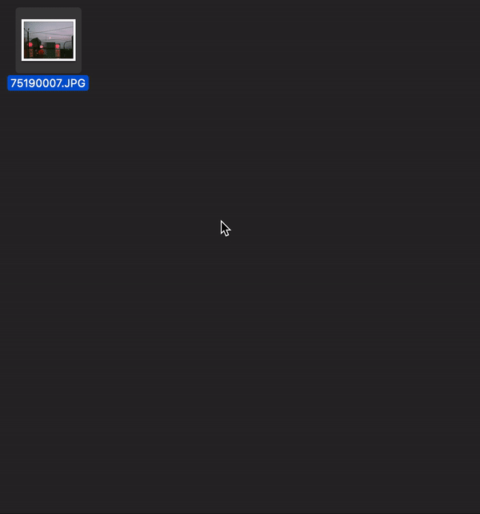

Simple tool. Fits any photo to white background square with N% spaces on biggest dimension. Useful for photographers to publish on Instagram
### Install
`go build`
### Usage
`photofit <input files, separated by space>`
- `-o` - path to save result image, allowed for 1 input file only
- `-p` - percentage of white spaces

Also, possible to call from context menu via special [Shortcut](https://www.icloud.com/shortcuts/7303ea6709c240be9933c6a99d666fe6) on Mac OS
(change path to your binary)

### Example
#### Source

#### Result

