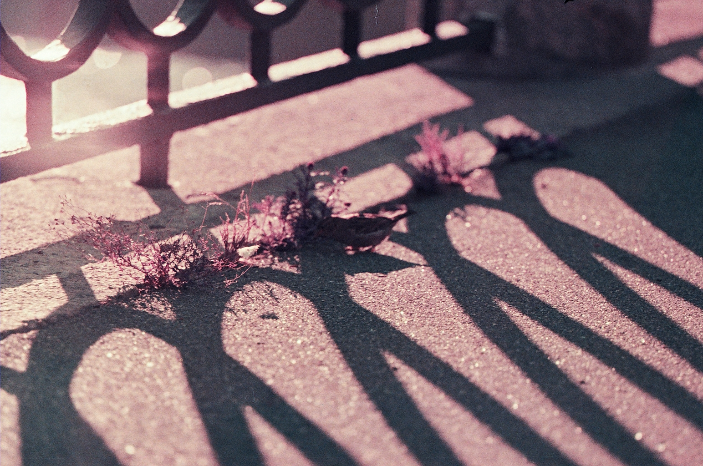
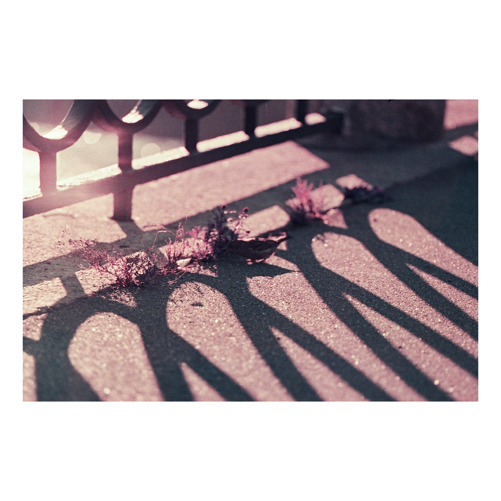

Simple tool. Fits any photo to white background square with N% spaces on biggest dimension. Useful for photographers to publish on Instagram
## Install
`go build`
## Usage
`<path to binary> -i ./input.png -o output.png -p 10`
- `-i` - path to source image
- `-o` - path to save result image
- `-p` - percent of white spaces
## Example
#### Source

#### Result

